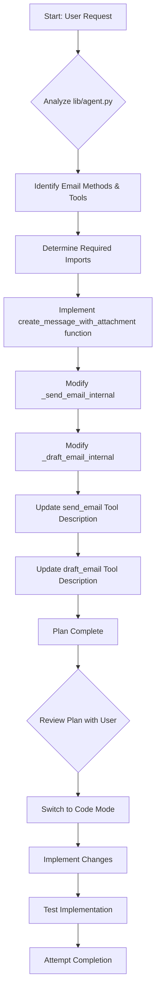

# Plan: Add File Attachment Capability to Agent Email Tools

## Objective

Enhance the `Agent` class in [`lib/agent.py`](lib/agent.py) to allow sending files as attachments in Gmail drafts and messages using the existing Gmail API integration.

## Current State

The `Agent` class currently has `send_email` and `draft_email` tools that use the Gmail API via internal methods (`_send_email_internal`, `_draft_email_internal`) and a message body creation function (`_create_gmail_message_body`). These methods only support plain text email bodies.

## Proposed Plan

Modify the existing email functionality to handle file encoding and include attachments in the email message structure. The agent should be able to attach any file type.

### Visual Representation of the Plan

### Step-by-step Implementation Details

1.  **Add Imports:**
    *   Import necessary modules at the top of [`lib/agent.py`](lib/agent.py): `mimetypes`, `email.mime.multipart.MIMEMultipart`, and `email.mime.base.MIMEBase`. Also ensure `base64` is imported (it already is).
    *   Ensure `os` is imported for checking file existence (it already is).

2.  **Create `_create_message_with_attachment` function:**
    *   Define a new internal method, e.g., `_create_message_with_attachment(self, to_email: str, subject: str, message_text: str, attachment_paths: list[str] | None = None) -> dict:`.
    *   Inside this function:
        *   Create a `MIMEMultipart('mixed')` message object.
        *   Set the 'To' and 'Subject' headers on the `MIMEMultipart` object.
        *   Attach the `message_text` as a `MIMEText` part (`message.attach(MIMEText(message_text, 'plain'))`).
        *   Check if `attachment_paths` is not None and is not empty.
        *   If there are attachments, loop through each `file_path` in `attachment_paths`:
            *   Verify the file exists using `os.path.exists(file_path)`. If not, log a warning or return an error message (though the tool description should guide the user to provide valid paths).
            *   Determine the MIME type using `mimetypes.guess_type(file_path)`. This returns a tuple `(type, encoding)`. Use the `type`. If `guess_type` returns `None`, default to `application/octet-stream`.
            *   Split the MIME type into main and sub types (e.g., 'application', 'pdf').
            *   Open the file in binary read mode (`'rb'`).
            *   Create a `MIMEBase` part: `part = MIMEBase(maintype, subtype)`.
            *   Set the payload of the part by reading the file content and encoding it with `base64.urlsafe_b64encode`: `part.set_payload(base64.urlsafe_b64encode(file_content).decode())`.
            *   Add the `Content-Disposition` header to specify it's an attachment and provide the filename: `part.add_header('Content-Disposition', f'attachment; filename="{os.path.basename(file_path)}"')`.
            *   Attach the part to the main message: `message.attach(part)`.
    *   Encode the complete `MIMEMultipart` message object into a raw, base64url encoded string: `base64.urlsafe_b64encode(message.as_bytes()).decode()`.
    *   Return the dictionary `{'raw': encoded_message_string}`.
3.  **Modify `_send_email_internal`:**
    *   Update the function signature to accept an optional list of attachment paths: `def _send_email_internal(self, recipient: str, subject: str, body: str, attachment_paths: list[str] | None = None) -> str:`.
    *   Inside the `try` block, replace the call to `_create_gmail_message_body` with a call to the new `_create_message_with_attachment` function, passing the `attachment_paths` argument: `message_payload = self._create_message_with_attachment(to_email=recipient, subject=subject, message_text=body, attachment_paths=attachment_paths)`.
4.  **Modify `_draft_email_internal`:**
    *   Update the function signature to accept an optional list of attachment paths: `def _draft_email_internal(self, recipient: str, subject: str, body: str, user_google_access_token: str, attachment_paths: list[str] | None = None) -> str:`. (Note: `user_google_access_token` is already a parameter here, keep it).
    *   Inside the `try` block, replace the call to `_create_gmail_message_body` with a call to the new `_create_message_with_attachment` function, passing the `attachment_paths` argument: `message_payload = self._create_message_with_attachment(to_email=recipient, subject=subject, message_text=body, attachment_paths=attachment_paths)`.
5.  **Update Tool Definitions:**
    *   In the `_add_tools` method, locate the `send_email_tool` and `draft_email_tool` definitions.
    *   Update their `description` strings to include the new optional parameter `attachment_paths` (string, a list of file paths to attach, e.g., `['/path/to/file1.pdf', '/path/to/file2.txt']`).

## Next Steps

Once this plan is written to the markdown file, I will ask you to switch to Code mode to implement these changes in [`lib/agent.py`](lib/agent.py).